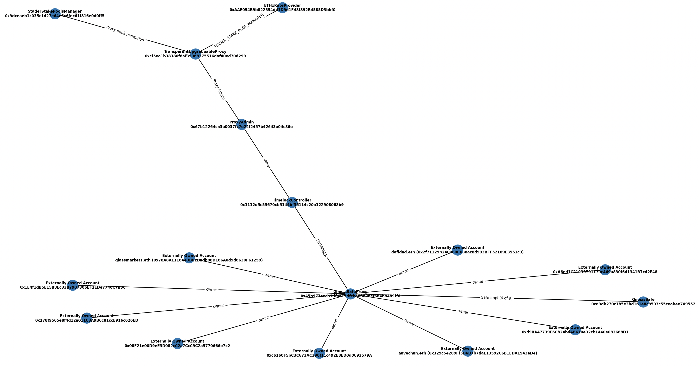

# Contract Dependency Investigator

## Overview
It can be incredibly tedious to dig through Etherscan to uncover all the different addresses that can impact the behavior of a contract, so this script is intended to investigate a given contract's dependencies on other contracts/addresses.

## Current Investigation Adapters
* **Naive**: Find all `address`es returned by no-input functions
* **EIP-1967 Transparent Proxy**: Get implementation contract from storage
* **TimelockController**: Get addresses that have been granted `PROPOSER_ROLE` by examining logs
* **Gnosis Safe + Proxy**: Get addresses of Safe `owners` and `implementation`
* **Ethereum Name Service**: Get ENS names of addresses (if applicable)

## Installation
```
cp sample.env <some_name>.env
# edit your env file to add relevant keys
source <some_name>.env

python3 -m venv ./venv && source ./venv/bin/activate
python3 -m pip install -r requirements.txt
python contractDependencies.py <contract_address>
```

## Sample

Running with:
```
python contractDependencies.py 0xAAE054B9b822554dd1D9d1F48f892B4585D3bbf0
```
outputs the following diagram 
